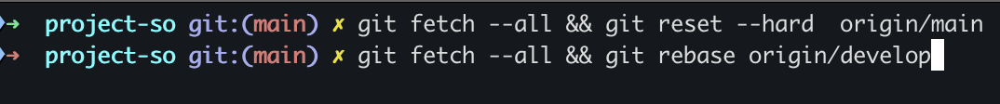
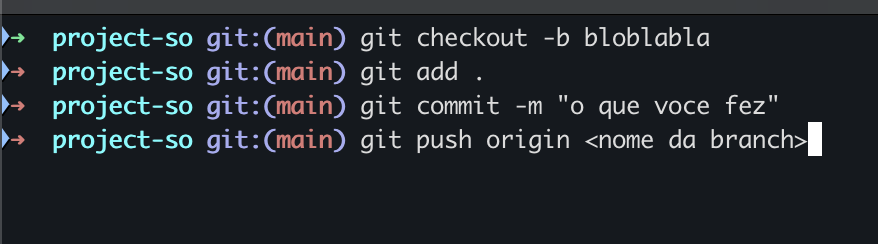

# SimuladorSo

## Setup

Clone o projeto via ssh (se tiver key) ou https (se nao tiver key):
- SSH: ```git@github.com:ItaloCouto7/project-so.git```
- HTTPS: ```https://github.com/ItaloCouto7/project-so.git```

Após clonagem entrar na pasta do projeto:
```cd project-so```

Após entrar na pasta fazer a instalação:
```npm i```

Caso der erro de Angular CLI fazer a instalação dele.

Pra entrar no codigo basta dar ```code .``` dentro da pasta do projeto.

colocar o projeto pra rodar localmente basta usar:
```ng serve``` 

## Sempre que for iniciar a codar

Antes de iniciar o codigo sempre atualizar seguindo o seguinte caminho no terminal:


Usar rebase se estiver mudança localmente. (Main**)
Usar reset hard se nao tiver nada a perder.


## Subir codigo

Para subir um codigo basta fazer os seguintes passos no terminal:


Após isso vai gerar um link para um Pull Request.


## Servidor de desenvolvimento

Para iniciar um servidor de desenvolvimento local, execute:

```bash
ng serve
```

Uma vez que o servidor esteja em execução, abra seu navegador e navegue até `http://localhost:4200/`. A aplicação será recarregada automaticamente sempre que você modificar qualquer um dos arquivos fonte.

## Criação de código

O Angular CLI inclui ferramentas poderosas para criação de código. Para gerar um novo componente, execute:

```bash
ng generate component nome-do-componente
```

## Construção

Para construir o projeto, execute:

```bash
ng build
```

Isso irá compilar seu projeto e armazenar os artefatos de construção no diretório `dist/`. Por padrão, a construção para produção otimiza sua aplicação para desempenho e velocidade.

## Recursos adicionais

Para mais informações sobre como usar o Angular CLI, incluindo referências detalhadas de comandos, visite a página [Visão Geral e Referência de Comandos do Angular CLI](https://angular.dev/tools/cli).
